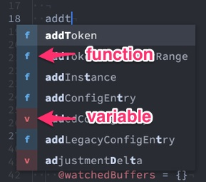

# SymbolProvider Config API

::: warning
Please note that its possible this is outdated, as its original version was published by @'Phil' on Jan 24, 2017.
:::

The builtin `SymbolProvider` allows showing the types of symbols in the suggestion list.



The icon colors are intended to match the syntax color of the symbol type. e.g. functions are blue in this theme, so the function icon is also blue.

Each language can tune how the `SymbolProvider` tags symbols by modifying the [config of the language package](https://github.com/pulsar-edit/language-coffee-script/blob/d86c8963dcee0ab811da05a175b2218045d0c124/settings/language-coffee-script.cson#L5).

```coffee
# An example for the CoffeeScript language
'.source.coffee':
  autocomplete:
    symbols:
      class:
        selector: '.class.name, .inherited-class, .instance.type'
        typePriority: 4
      function:
        selector: '.function.name'
        typePriority: 3
      variable:
        selector: '.variable'
        typePriority: 2
      '': # the catch-all
        selector: '.source'
        typePriority: 1
      builtin:
        suggestions: [
          'one'
          'two'
        ]
```

A more generic example:

```coffee

'.source.language':
  autocomplete:
    symbols:
      typename1:
        selector: '.some, .selectors'
        typePriority: 1
      typename2:
        suggestions: [...]
      typename3:
        ...
```

Any number of Typename objects are supported, and `typename` can be anything you choose. However, you are encouraged to use one of the predefined `typenames`. There are predefined styles for the following types:

```
builtin
class
constant
function
import
keyword
method
module
mixin
package
property
require
snippet
tag
type
value
variable
```

## Typename Objects

Typename objects support the following properties:

* `selector`: The selector that matches your symbol types. e.g. `'.variable.name'`. You can also have several selectors separated by commas, just like in CSS `'.variable.name, .storage.variable'`
* `typePriority`: The priority this Typename object has over others. e.g. in our CoffeeScript example above, if a symbol is tagged with the `function` type in one part of the code, but `class` in another part of the code, it will be displayed to the user as a `class` because `class` has a higher `typePriority`
* `suggestions`: This allows you to specify explicit completions for some scope. A good use is builtins: e.g. `['Math', 'Array', ...]` in JavaScript
  * Items in the `suggestions` list can also objects using any of the [properties](/packages_wiki/autocomplete-plus/provider-api.md#suggestions) from the provider API.

## Finding Scope Selectors

Coming up with the selectors for a given Typename object might be the hardest part of defining the `autocomplete.symbols` config. Fortunately there is a tool to help

Open the [command palette](https://atom.io/docs/latest/getting-started-atom-basics#command-palette), then search for `log cursor scope`. You will be presented with a blue box like the following:


Each bullet in the box is a node. The last bullet is the symbol itself, and each preceding line is a parent of the symbol &mdash; just like CSS. With this information, you can see that the symbol can be matched with several selectors: `'.variable'`, `'.variable.assignment'`, `'.source.coffee .variable'`, etc.
